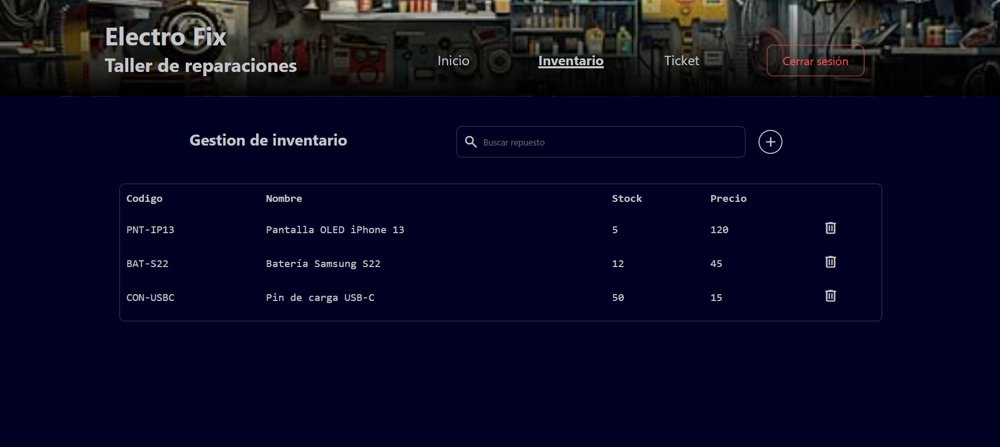

# 🔧 Electro Fix - Sistema de Gestión de Inventario y Tickets

Una aplicación web Full-Stack diseñada para administrar el flujo de trabajo de un taller de reparaciones. Permite el control de inventario de repuestos en tiempo real y la gestión del estado de los tickets de reparación de manera segura y eficiente.



## 🚀 Características Principales (Features)

*   **Autenticación de Usuarios:** Sistema de login seguro utilizando tokens de sesión.
*   **Rutas Protegidas (Protected Routes):** Control de acceso en el frontend que redirige a los usuarios no autenticados y previene la visualización de componentes privados.
*   **Operaciones CRUD:** Creación, lectura, actualización y eliminación de repuestos y tickets en tiempo real.
*   **Seguridad de Base de Datos (RLS):** Implementación de Políticas de Seguridad a Nivel de Fila (Row Level Security) en el servidor para garantizar que solo usuarios autenticados puedan modificar o consultar datos.
*   **Experiencia de Usuario (UX):** 
    *   Indicadores de carga (Loading states) para manejo de peticiones asíncronas.
    *   Notificaciones flotantes (Toasts) para confirmación de acciones exitosas.
    *   Interfaz 100% responsiva (Mobile-First) con navegación adaptativa.

## 💻 Tecnologías Utilizadas

| Categoría | Tecnología / Herramienta |
| :--- | :--- |
| **Frontend** | React, React Router DOM |
| **Estilos** | CSS3 (Variables nativas, Flexbox, UI Responsiva) |
| **Backend as a Service** | Supabase |
| **Base de Datos** | PostgreSQL (Gestionada vía Supabase) |
| **Despliegue** | Vercel (Configurado como Single Page Application) |

## 🌐 Enlace del Proyecto (Demo)

Puedes ver la aplicación en producción aquí: https://elecro-fix-react.vercel.app

**Credenciales de prueba para reclutadores:**
* **Email:** test@electrofix.com
* **Contraseña:** 123456

## 🛠️ Instalación y Configuración Local

Si deseas correr este proyecto en tu entorno local, sigue estos pasos:

1. Clona este repositorio:
   ```bash
    git clone https://github.com/Lauti-araya/Elecro-fix-react.git
   ```

2. Instala las dependencias:
   ```bash
   npm install
   ```

3. Configura las variables de entorno:
   Crea un archivo `.env` en la raíz del proyecto y agrega tus credenciales de Supabase:
   ```env
   VITE_SUPABASE_URL=tu_url_de_supabase
   VITE_SUPABASE_ANON_KEY=tu_clave_anonima
   ```

4. Inicia el servidor de desarrollo:
   ```bash
   npm run dev
   ```